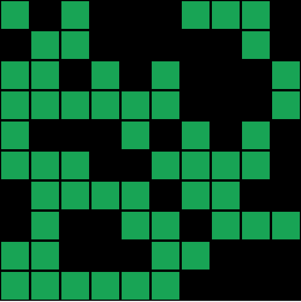
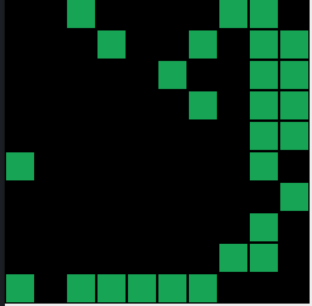

# [Le jeu de la vie](https://fr.wikipedia.org/wiki/Jeu_de_la_vie)
## Description
Le jeu de la vie (jeu des automates cellulaires) est un programme simulant l'évolution d'un ensemble de cellules (appelées structures cellulaires) sur une grille à deux dimensions.

Les cellules ont deux états possibles: soit mortes, soit vivantes.

Le jeu se déroule de façon séquentielle: L'état des cellules dans une étape détermine l'état des cellules dans l'étape suivante.

L'état futur d'une cellule (si elle nait ou elle meurt), est déterminé grâce à un ensemble de règles très simples :

* Une cellule vivante possédant 2 ou 3 voisines vivantes reste vivante
* Une cellule vivante possédant moins de 2 voisines vivantes meurt (souspopulation)
* Une cellule vivante possédant plus de 3 voisines vivantes meurt (surpopulation)
* Une cellule morte possédant trois voisines vivantes devient vivante (elle nait)

## Exemples
Si, au temps t, la grille ressemble à ceci:

Au temps t+1, l'état des cellules aura changé, comme ceci:

## Exercice
Le but de l'exercice est de simuler un jeu de la vie en ruby. Essayez d'adopter une approche orientée objet. N'oubliez pas de testez vos classes!

## Etapes et Guidelines
Si vous souhaitez un peu d’aide, vous pouvez dérouler ce qui suit. Spoiler alert !

Création de la classe Cell
Commencons par créer une classe cell. En

Création de la classe Board, et implémentation de la liste des cellules
Créons ensuite la classe Board

Utilisation des classes Cell et Board
Il n’y a plus qu’à créer l’algorithme !

Affichage du board dans la console.
C’est bien tout ca, mais on ne voit rien ! Et si on imprimait nos résultats dans la console ?

Un framework pour faire des applications avec Ruby : Shoes.

## Pour aller plus loin
Vous pouvez regarder l'excellent documentaire sur la chaîne [Le Jeu de la Vie — Science étonnante #49 - YouTube](https://www.youtube.com/watch?v=S-W0NX97DB0) pour en apprendre plus sur le jeu de la vie.
